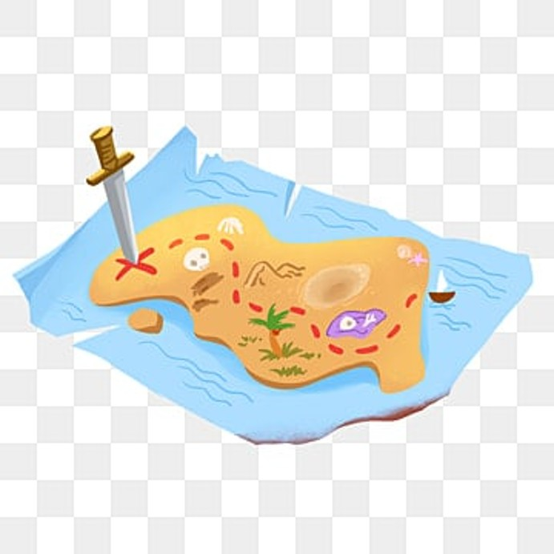
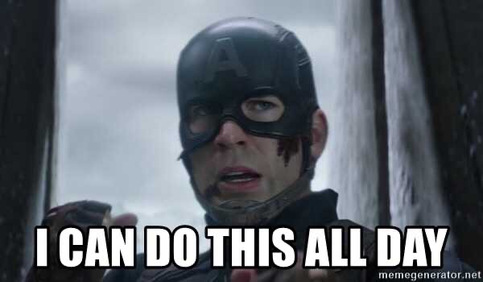
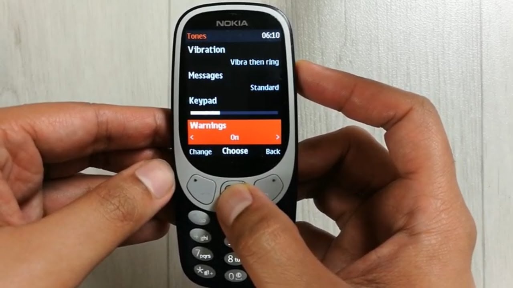
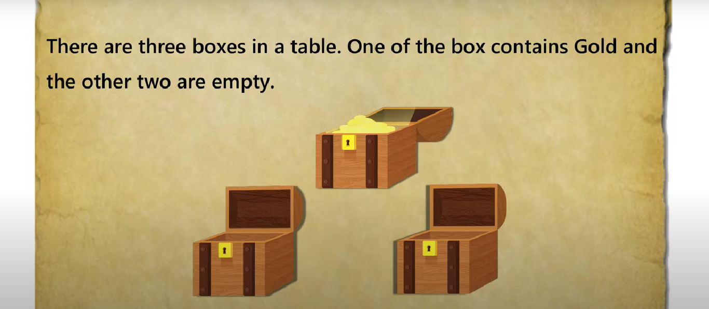

# Treasure Hunt

<p align="center">
    
<br><br>
Embark on a hand-crafted immersive treasure hunt game filled with excitement, adventure, and surprises at every turn. Take flight and dive deep into a world of trivia, puzzles, and challenges to prove yourself as a wing master 
</p>
<br>

## Table of Contents
<!-- <> -->
* [Game Features](#game-features)
* [Player and Analytics](#player-and-analytics)
* [Authentication](#authentication)
* [Authorization and Security](#authorization-and-security)
* [Structure of the game](#structure-of-the-game)
* [General Instructions for the game](#general-instructions-for-the-game-are-as-follows)
* [Stage 1: Start the treasure](#stage-1-ready-for-takeoff)
* [Stage 2: Welcome Hunters](#stage-2-save-the-souls)
* [Stage 3: The Next Game](#stage-3-the-numble-game)
* [Stage 4: The lost Treasure](#stage-4-the-lost-artefact)
* [Stage 5: The final Treasure](#stage-5-the-flying-enigma)
* [Wing Master Badge](#wing-master-badge)
* [Tech stack](#tech-stack)
* [Project Set-up](#project-set-up)
* [Credits](#credits)
<!-- <> -->

## Game Features

- [x] 5 stages of game
    1. Start the Treasure
    2. Welcome Hunters
    3. The Next Hunters
    4. The lost Treasure
    5. The final Treasure
- [x] Soft skills assessed
    1. Critical Thinking
    2. Decision Making
    3. Patience
    4. Problem Solving
    5. Eye for Detail
    6. Logical reasoning
    7. Lateral Thinking
    8. Auditory
<!--     <p align="left"> -->
- [x] Dead Ends
    1. First on stage 2:  Save the Souls
    2. Second on stage 3:  The Numble Game
<br>


### Player, Analytics and Insights
- [x] User leader board
- [x] Admin Panel
- [x] Player Analytics and Reward after user finish all levels.
- [x] Overall and  each Player's analytics in admin panel
- [x] Palyers can't skip level by changing web adress.
- [x] Saving user state and level after each stage in databse.

## Authentication 
- [x] Sign in with Google (Oauth) [recommended for better user experience]
- [x] User Sign up
- [x] User Sign in
- [x] admin login

## Authorization and Security

Only logged in users can:
- [x] Play game
- [x] Access player analysis
- [x] Only admin can access Admin Panel


# Structure of the game

- The game has develoved to asses user's soft skill while providing an immersive experience.  


## General Instructions for the game are as follows:

1) For an enhanced user experience, I suggest signing in with Google.

2) To achieve the best scores, it is advisable to complete all stages in one session while recording time taken.

3) Each stage is sequentially incremented, and the time taken by the user is saved in the database.

4) Resuming the game from where you left off is always an option.

5) Every level contains essential instructions that serve as clues to progress further, so read them carefully.

6) If you encounter a dead end, don't worry, you can choose to replay the game again.

# Stage 1: Start the Treasure
<hr>
## Soft skills tested: 

- Critical Thinking
- Eye For Detail

## Dead end: 0

## Clues: 

    - The image showcase a Treasure view and you are the captain of the team.


## Story
```
You are the captain of the team to find the Treasure. Start the treasure hunt by opening the correct door.
```

## Puzzle

The Image of a three doors there is a single door to start guess the correct door to start the game.

## Solution

<details> 
  <summary> Click to view ? </summary>
  Click on The third door
</details>

## Motive

This stage aims to give players a head start and take them on a thrilling journey of treasure hunting.  

<br>

# Stage 2: Welcome Hunters
<hr>
<p align="center">
        
    </p>


## Soft skills tested: 

- Decision Making
- Eye for Detail
- Problem Solving
- Memory


## Clues: 

You are given a extrnal link, you need to look to clues in the picture.

## Story
```
Its a captain america dialogue Find the right answer .  
```

## Dead end: 1

- If the player choose a different answer, the plane suffer a fatal crash, Hence Deadend.

## Solution

<details> 
  <summary> Click to see? </summary>
  **Yeah** I know I know 
</details>

## Motive

This stage is design to assess memory and decision making skills.

<br>

# Stage 3: The Next Hunters
<hr>
<p align="center">
        
    </p>


## Soft skills tested:

- Logical Reasoning
- Lateral Thinking


## Clues: 
- You are given a riddle and you can also make intelligent guess, if you are right the input fields are green.

## Story

```
The old style phone messaging in key pad mobile. 
```

## Puzzle

Solve the number Puzzle based on the clue and intellingent guess.

## Dead end: 1

There are multiple answer incorporated in this level, if the player answers otherwise, leads to a deadend.

## Solution
<details> 
  <summary> Click to see? </summary>
    How are you
</details>

## Motive
The stage tests user of thier knowledge of niche things and asses the logical comprehension. 


# Stage 4: The lost Treasure
<hr>


## Soft skills tested: 
- Comprehension
- Auditory 

## Clues: 
    The audio is your clue.
    
## Story

```
The lost Treasure, the treasure that was never found, the greatest mystery of all times. 
```

## Puzzle
    You need to listen to the audio and answer correctly.

## Solution
<details> 
  <summary> Click to see? </summary>
  straight
</details>

## Motive

The satge is to test user compreshension and Auditory Skills.

<br>

# Stage 5: The Final Treasure
<hr>
<p align="center">
        
    </p>


## Soft skills tested: 

- Eye for Detail
- Lateral Thinking

## Clues: 

- As the name suggests "The Final", the picture and riddle is your clue.  

## Story

```
From the given Clue find where is the treasure
```

## Puzzle

The final showdown, answer the riddle with full answer to get your reward. 

## Solution

<details> 
  <summary> Click to see? </summary>
 Box A
</details>

## Motive

The stage test the curiosity of the user and testing player patience to extreme. 

<br>

# Tech Stack:

## Frontend


## Backend


## Database and Authentication


Database Structure Used

## Hosting 


# Project Set-up
## Install Node
- #### Node installation on Windows

    $ winget install node

- or go on [official Node.js website](https://nodejs.org/) and download the installer.
 Also, be sure to have `git` available in your PATH.

- #### Node installation on Linux

  You can install nodejs and npm easily with apt install, just run the following commands.

      $ sudo apt install nodejs
      $ sudo apt install npm

## Install Project through CLI

    $ git clone https://github.com/adithyathecoder/Treasure
    $ cd artefact
    $ npm install

## Configure Project

To set up this project for yourself, you will need to create a project on Firebase and 
replace the credentials at the necessary locations, as this project utilizes Firebase technology.

### Install The dependencies

    $ npm install firebase

    $ npm install -D tailwindcss

    $ npx tailwindcss init

    $ npm install react-icons

    $ npm i node-sass

    $ npm install saas
    
    $ npm install chart.js
    
## Run the Project 
    $ npm start
<br>

# Credits
github : https://github.com/synapse2001
